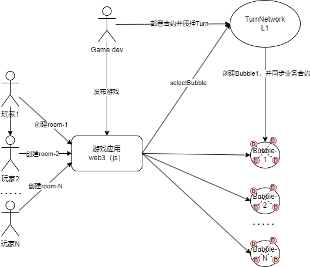

# 1、白皮书里面强调了Turn重点解决的问题：
- 性能问题：通过横向扩容解决
- 手续费问题：如何解决？
- 游戏开发问题：其实把游戏业务跟分片链深度结合，既能解决性能问题，又可以解决游戏开发问题



- 比如游戏开发的时候，提供了一个solidity的API  `  uint bubbleId = Bubble.selectBubble(size);  `
selectBubble这个方法非常灵活且强大
- 当游戏逻辑合约创建room1的时候，调用selectBubble方法，TurnNetwork会创建一个Bubble1网络，并把这个room1跟这个Bubble1网络绑定后，把Bubble1网络的信息返回给游戏客户端
- 如果有新用户进入游戏并创建room2的时候，调用selectBubble方法，TurnNetwork会判断Bubble1网络是否拥塞，如果拥塞，则会创建一个Bubble2网络，并把room2跟这个Bubble2网络绑定后，把Bubble2网络的信息返回给游戏客户端，如果Bubble1网络不拥塞，则会把room2跟Bubble1网络绑定并快速把Bubble1的信息返回给游戏客户端
- 以此类推，TurnNetwork可以根据参与游戏玩家数量以及业务拥塞的程度，自动横向扩容的方式解决性能问题，实现业务的弹性

  这是TurnNetwork的核心竞争力

对于游戏开发商来说，需要实现两个合约：
- 第一个叫门面合约Face，Face合约只运行在TurnNetwork（L1层），负责为游戏业务分配具体的Bubble网络，并实现资产跨链互结算能力

```
pragma solidity ^0.8;

// 门面合约
contract Face {
	
  // 创建一个游戏房间，随机获取一个bubble，如果没有则新建一个bubble，而后将游戏房号和bubble绑定
	function CreateRoom public {
		bubbleID = selectBubble() 
		...
	}

  // 玩家加入游戏房间
	function joinRoom(roomID int) public {
		...
	}

  // 将逻辑合约部署到bubble，并且设置初始化信息
	function prepareRoom(roomID int) onlyCreator{
		...
		remoteDeploy(bubbleID, Logic, address, data)
		...
	}

  // 结算
	function settle() {
		...
	}
}
```

- 逻辑合约Logic是游戏开发商需要实现的具体游戏业务的逻辑部分，其中在结束游戏的时候，需要调用Face合约的结算方法对该游戏进行资产结算回TurnNetwork

```
pragma solidity ^0.8;

// 逻辑合约
contract Logic {
	
	function startGame() public {
		...
	}

	function endGame() public {
		...
		remoteCall(Face, "settle", data)
	}
}
```

-在bubble强制销毁时，会逐个执行逻辑合约的destroy方法，而destroy方法由游戏开发商自己实现，可能需要在destroy之前完成资产结算。

```
interface TRC1 {
  // 销毁时自动执行
	function destroy() onlyBubble;
}
```
