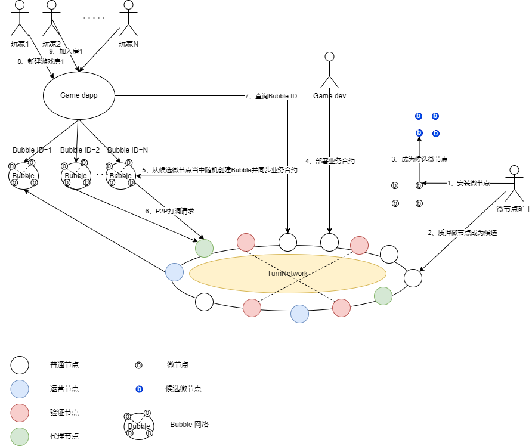

# 全链游戏的基础设施
## 1、性能和弹性
自动分片机制且分片链可回收

- 目前以太坊L2的扩容方案因为安全性依赖于以太坊主网络，都是至下而上的方式，通过把L2层的交易证明打包提交到以太坊网络来实现扩容。
- TON提供了一种新的思路，假设重建一条主链，则L2层的扩容方案更具弹性，比如TON自动分片机制，且分片链可以回收。
- TurnNetwork参考了TON，为全链游戏提供更好的基础设施，也采用自动分片机制，且分片链生命周期跟游戏业务有一定的相关性，游戏开发商在L1层部署业务合约的时候，需要指定该业务运行分片链的数量且需要质押一定的Token，TurnNetwork则会自动创建对应数量的分片链并自动部署业务合约到这些分片链之上，最为神奇的地方是这些分片链并不会在初始阶段全部创建，而是在游戏业务运行期间，根据业务性能需求自动创建，而且还能实现回收，当该分片链长期没有使用的时候。这样可以最大限度的为游戏运营商节约运营的费用。
  - 假设游戏开发商开发全链游戏，需要像部署传统游戏一样，如果把一条分片链当做是一个游戏的服务器（或者一个房、一个牌桌、一个地图分区），可以在L1层业务合约里面指定初始需求是一条分片链，最多可以使用到N条分片链，然后质押相应的Token以后，TurnNetwork就可以自动帮游戏开发商来完成相关的部署。
    - TurnNetwork一开始会创建一条分片链，并把业务合约从L1同步到这条分片链上面，然后锁定一定比例的Token，如果当游戏玩家多起来的时候，TurnNetwork会监控该分片链上每个区块的交易数量来判断当前交易的拥挤度，从而决定是否新建一条分片链来容纳更多的玩家，这个时候再新开一个房的时候，或者新开一个牌桌的时候，可能就会落在新的分片链上了。
    - 当玩家退出游戏，TurnNetwork监控到该分片链上的区块上交易数据为0并且持续一段时间以后，会自动回收这条分片链，并且把分片链上资产数据结算回L1层，而区块数据则会打包备份到结构化的区块链（如ipfs）上。
从理论上来说，通过L1层来管理分片链，可以实现L1层的扩容来提高L1层的性能，并且为了避免浪费，还能实现分片链的回收，这样就让TurnNetwork拥有了足够的弹性，可以想象一下，当亚马逊云平台上某个电商为了双十一的活动准备100台云服务器，但是当双十一过去后，这100台云服务器需要退回，这样可以极大的满足电商的需求和很好的成本控制。

TurnNetwork的安全性
TurnNetwork本身是基于pos+bft的共识机制和以太坊的账户模型为基础开发的公链，这种组合目前看是公链发展的趋势，以太坊主链也从pow转向pos机制。
所以从技术架构和共识机制来看，TurnNetwork的安全性是可以得到保证的。

TurnNetwork的分片链的安全性和性能极具挑战
TurnNetwork的分片链又称为bubble网络，为了让bubble网络具备足够的随机性和去中心化的能力，参与共识的节点选择了移动设备

## 下面重点说明bubble网络
### 优势
 - 移动设备众多，足以支撑足够多的bubble网络
 - 组网的足够随机性从而让共谋作恶的概率降低，提高网络的安全性
### 挑战
 - 研发一种适合生命周期短暂的区块链网络的共识机制，并且需要适应移动网络环境，是bubble网络最主要的挑战
   - 移动网络环境不稳定，而且没有公网IP，组网需要先P2P打洞
   - 需要有几个假设的前提，移动设备在被选中组建bubble网络时
     - 最好连上wifi网络，而不是在频繁移动当中（如坐电梯或者在山区旅游）
     - 并且处于充电状态（或者电量比较足）
由于TurnNetwork采用的是可伸缩分片机制，也就是说满足横向扩容的要求，但对于具体每个分片链的性能要求却不高，假设每个bubble网络的tps能到1000，则同时创建1万个bubble网络的TurnNetwork的总的tps能达到1000万tps，而对于pos+bft共识机制的公链来说，tps1000并不是一个艰难的挑战。
所以bubble网络依然采用的是pos+bft的共识机制，但bubble网络依然在共识机制方面的探索并没有停止，bft算法在不降低容错率的前提下，采用了半异步的方式简化实现且提高性能（参考HotStuff&c-bft）。

#### 半异步bft算法HotStuff：
相比较 PBFT，HotStuff 的最主要贡献在于实现了线性主节点切换，该算法中，提案需要经过三轮交互才能够被提交，虽然增加了少许通信延迟，但是这样的设计方式简化了 PBFT 中复杂的主节点切换流程，也更便于工业化实现。
此外，HotStuff 在共识算法中加入了聚合签名，使得在每轮主从节点的交互中，从节点只需要向当前轮次主节点单播消息，由主节点收集投票并聚合成为一个决议证书（Quorum Certificate，QC），再将 QC 其广播给从节点，从节点从过对 QC 进行校验就可以对当前轮次的 Quorum 决议进行验证。
通过这种机制，将 BFT 算法的通信复杂度进一步降低到 ，更低的通信复杂度也让 HotStuff 具有更好的扩展性。

#### 全异步bft算法HoneyBadgerBFT：
HoneyBadgerBFT算法的核心是RBC广播协议，主要思想是，网络节点可以同时广播交易，通过BA算法形成一致的交易列表。
论文指出HoneyBadgerBFT算法的复杂度是O(NlogN)，在网络节点少的情况下（比如，8节点），HoneyBadgerBFT性能稍逊PBFT算法。
但是在网络节点变多的情况下，HoneyBadgerBFT算法的性能几乎不变，而PBFT算法的性能显著下降。

## TurnNetwork整体视图

- TurnNetwork就是一条pos+btf的公链，具备自动伸缩分片子链的能力，并由验证节点、运营节点以及代理节点组成。
  - 验证节点
  系统从质押成为验证节点候选人里面随机（VRF算法）选举一组验证节点，轮流出块并参与bft共识，这组节点完成出块后，系统又重新上一过程循环往复；
  - 运营节点
  承担创建分片子链（Bubble网络）并和分片子链跨链通信的节点 
  - 代理节点
  负责为分片子链的节点组网时进行P2P打洞时的代理节点，因为分片子链的节点并不要求具备公网IP，可以是移动设备或者PC机

- Bubble网络则是TurnNetwork的分片子链，属于L2层的扩容，TurnNetwork和Bubble网络之间通过内部跨链协议通信，可以完成资产跨链结算，也支持数据双向跨链通信。
- 微节点矿工只需要在移动设备或者PC机上安装微节点客户端并且在TurnNetwork上质押成为微节点候选人即可有机会参与挖矿获取收益
- 游戏开发者实现系统要求的业务模版合约接口后，并把合约部署到TurnNetwork上质押一定Token，TurnNetwork就会自动从微节点候选人中选举相应的微节点并组建成Bubble网络，同步业务合约到该Bubble网络之上
- 当玩家加入游戏并开局玩游戏的时候，游戏应用从TurnNetwork的主业务合约里面可以查询到游戏应用需要的Bubble网络路由信息，并向该Bubble网络发起业务合约调用，进入游戏业务合约逻辑，玩家就可以在Bubble网络体验全链游戏了
- 

